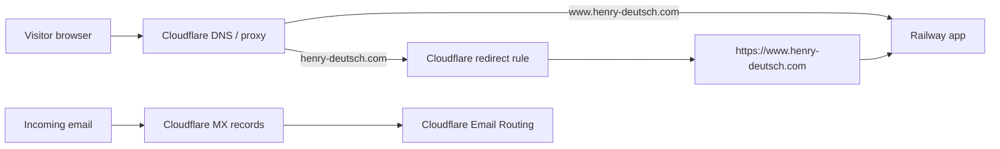
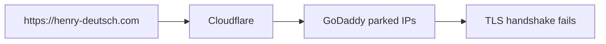
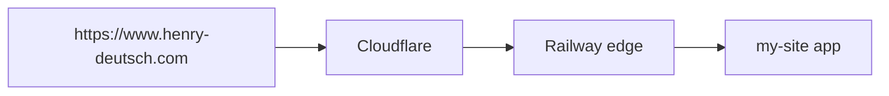

# Cloudflare DNS and Railway Hosting

Last updated: May 24, 2026, US Eastern.

This doc explains the DNS setup for `henry-deutsch.com`, the Cloudflare SSL 525 incident, and the expected steady-state configuration for Railway hosting plus Cloudflare Email Routing.

## Goal

The site should behave like this:

- `https://www.henry-deutsch.com` serves the Railway app.
- `http://www.henry-deutsch.com` upgrades to `https://www.henry-deutsch.com`.
- `http://henry-deutsch.com` redirects to `https://www.henry-deutsch.com`.
- `https://henry-deutsch.com` redirects to `https://www.henry-deutsch.com`.
- Paths and query strings should be preserved during the root-to-www redirect.

The canonical public hostname is `www.henry-deutsch.com`. The bare/root domain `henry-deutsch.com` only exists to redirect people to `www`.

## Mental Model

DNS does not host the website. DNS is the internet address book that tells browsers which service should receive traffic for a hostname.

Railway hosts and serves the app. Cloudflare owns the public DNS zone and sits in front of the site for proxied records. Cloudflare Email Routing handles mail for `me@henry-deutsch.com`.

For this setup:



## DNS Terms Used Here

`@` means the apex/root domain. In this zone, `@` is shorthand for `henry-deutsch.com`.

`www` means the subdomain `www.henry-deutsch.com`.

`A` means address record. It maps a hostname directly to an IPv4 address, such as `3.33.251.168`.

`CNAME` means canonical name. It makes one hostname an alias of another hostname. For this site, `www` is a CNAME to Railway's routing hostname.

`MX` means mail exchange. It tells the world where email for `@henry-deutsch.com` should be delivered.

`TXT` means text record. These are commonly used for verification and email security. Examples include Railway domain verification, SPF, and DKIM.

`Proxied` in Cloudflare means traffic goes through Cloudflare first. Visitors see Cloudflare as the edge, then Cloudflare connects to the origin service.

`DNS only` means Cloudflare only publishes the DNS answer. Traffic does not pass through the Cloudflare proxy. Mail records should generally be DNS-only.

## Important Current Records

Keep the `www` record pointed at Railway:

| Type | Name | Target | Proxy |
| --- | --- | --- | --- |
| `CNAME` | `www` | `tw22k3fz.up.railway.app` | Proxied |

Keep the Railway verification TXT record:

| Type | Name | Value |
| --- | --- | --- |
| `TXT` | `_railway-verify.www` | starts with `railway-verify=327832...` |

Keep Cloudflare Email Routing records:

| Type | Purpose |
| --- | --- |
| `MX` | Route mail for `henry-deutsch.com` through Cloudflare Email Routing. |
| `TXT` SPF | Authorize mail senders / forwarding behavior. |
| `TXT` DKIM | Authenticate forwarded mail. |

Do not delete the MX, SPF, or DKIM records unless intentionally replacing the email provider. Those are for `me@henry-deutsch.com`, not the website.

## The 525 Incident

People visiting `https://henry-deutsch.com` saw:

`SSL handshake failed`, Cloudflare error `525`.

That means:

1. The visitor reached Cloudflare successfully.
2. Cloudflare tried to connect to the origin server for `henry-deutsch.com` over HTTPS.
3. The origin failed the TLS/SSL handshake.

The browser and Cloudflare were working. The failure was between Cloudflare and the origin that the root domain pointed to.

## Root Cause

Before moving DNS to Cloudflare, GoDaddy had records like:

- `www` CNAME to `tw22k3fz.up.railway.app`
- root/apex `@` as GoDaddy parked/forwarding infrastructure

After Cloudflare took over DNS, Cloudflare imported or recreated the root/apex as proxied A records:

- `henry-deutsch.com` A `3.33.251.168`
- `henry-deutsch.com` A `15.197.225.128`

Those IPs are GoDaddy/AWS parked-domain infrastructure, not the Railway app.

The likely old behavior was that GoDaddy forwarded `henry-deutsch.com` to `www.henry-deutsch.com`. But that forwarding behavior was not preserved just by copying DNS records into Cloudflare. DNS records and domain forwarding are separate things.

So the broken shape was:



The working shape for `www` was:



## Why It Worked Locally Sometimes

It is easy to miss this problem locally because:

- You may type or autocomplete `www.henry-deutsch.com`, which was working.
- Browser redirects and HSTS can hide whether you started at `http`, `https`, root, or `www`.
- Cached DNS and cached redirects can differ across devices.
- Incognito and command-shift-r do not guarantee a globally fresh DNS path.

The reliable test is not "does my browser seem to load"; it is checking each hostname and protocol explicitly.

## Railway Hostname Nuance

`tw22k3fz.up.railway.app` is the CNAME target for Railway routing.

That does not mean `https://tw22k3fz.up.railway.app` must load the site in a browser. Railway can route based on the HTTP `Host` header, and the app/domain is configured for `www.henry-deutsch.com`.

Observed behavior:

- `https://tw22k3fz.up.railway.app` can show Railway's `Not Found` page.
- `https://www.henry-deutsch.com` can still work correctly through that same Railway target.

So do not "fix" the CNAME just because the raw Railway target URL shows Not Found.

## Fix Applied

Cloudflare now has a redirect rule that sends the root domain to `www`.

Rule details:

- Product: Cloudflare Redirect Rules
- Type: Single Redirect
- Template used: Redirect from root to WWW
- Match type: Wildcard pattern
- Request URL: `http*://henry-deutsch.com/*`
- Target URL: `https://www.henry-deutsch.com/${2}`
- Status: `301 - Permanent Redirect`
- Preserve query string: enabled

This means both HTTP and HTTPS requests for the root domain redirect to the canonical `www` URL.

Example:

```text
https://henry-deutsch.com/projects?x=1
-> https://www.henry-deutsch.com/projects?x=1
```

## Expected Verification

Use these checks after any DNS, Cloudflare, or Railway domain change:

```bash
curl -I -L http://henry-deutsch.com/
curl -I -L https://henry-deutsch.com/
curl -I -L http://www.henry-deutsch.com/
curl -I -L https://www.henry-deutsch.com/
curl -I -L 'https://henry-deutsch.com/test/path?x=1&y=2'
```

Expected results:

- Root `http://henry-deutsch.com` redirects to `https://www.henry-deutsch.com`.
- Root `https://henry-deutsch.com` redirects to `https://www.henry-deutsch.com`.
- `www` returns `200`.
- Final successful responses include Railway headers such as `server: railway-edge` or `x-railway-edge`.
- Test paths and query strings are preserved.

A good quick browser test is:

```text
https://henry-deutsch.com/?cache-bust=manual-test
```

The final address bar should become:

```text
https://www.henry-deutsch.com/?cache-bust=manual-test
```

## What Not To Change Casually

Do not remove the `www` CNAME to Railway unless Railway gives a new target.

Do not delete the `_railway-verify.www` TXT record unless Railway says the domain no longer needs it.

Do not delete Cloudflare Email Routing MX/TXT records unless intentionally disabling or replacing `me@henry-deutsch.com`.

Do not point the root domain back at GoDaddy parked IPs and expect the website to be hosted there. GoDaddy parked IPs are not the app.

Do not assume the raw Railway CNAME target should load in a browser. The custom domain is the public URL.

## If 525 Comes Back

Check these in order:

1. Does `https://www.henry-deutsch.com` return `200`?
2. Does `https://henry-deutsch.com` redirect to `https://www.henry-deutsch.com`?
3. Is the Cloudflare redirect rule still active?
4. Is the `www` CNAME still pointed to Railway?
5. Is the `www` record proxied in Cloudflare?
6. Does Railway still show `www.henry-deutsch.com` as the deployed custom domain?
7. Did the root/apex A records get changed to a non-Railway/non-redirect origin?

If only the root domain is broken and `www` works, the problem is probably the Cloudflare root redirect or root/apex DNS records.

If `www` is broken too, check Railway deployment/domain status before spending time on the root redirect.

## Cloudflare API Caution

A Cloudflare API token may exist in `.env` as `CLOUDFLARE_API_TOKEN`.

During debugging, local `curl` calls to `https://api.cloudflare.com` appeared to be intercepted by a router certificate for `www.routerlogin.net`. Do not bypass that with `curl -k` while sending an API token. That would risk sending the token over a connection whose TLS identity is not Cloudflare.

If a token was created only for this repair, revoke it in Cloudflare or remove it from local env files when it is no longer needed.

